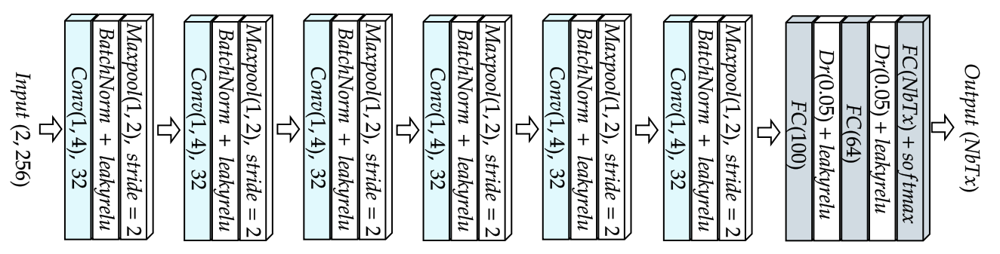
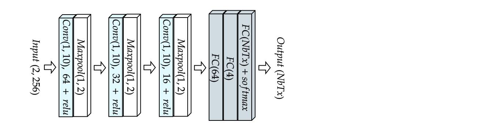

# Neural Networks for Radio-Frequency Fingerprint Identification 

In this repository are presented the Neural Networks used for the article in Julia. 

## Description

We used the following neural networks :
- [Sankhe CNN](https://ieeexplore.ieee.org/document/8882379)

- [Elmaghbub CNN](https://arxiv.org/abs/2308.04467) 

- [Arroyo CNN](https://www.mdpi.com/1424-8220/22/6/2111)

- [Feng CNN-GRU](https://ieeexplore.ieee.org/document/9851177) 

- Triple Dense (ours)

## Learning rates for each Network-Dataset combination

|                     | **Sankhe CNN** | **Elmaghbub CNN** | **Arroyo CNN** | **Feng CNN-GRU** | **Triple Dense (ours)** |
|---------------------|----------------|-------------------|-----------------|------------------|------------------------|
| **Oracle Dataset**  | 0.0001         | 0.0001            | 0.001          | ------           |  0.01                 |
| **POWDER Dataset**  | 0.0001         | 0.0001            | 0.0001          | ------           | 0.01                 |
| **WiSig Dataset**   | 0.0001        | 0.001            | 0.001          | ------           | 0.01                 |
| **Elmaghbub Dataset**| 0.0001        | 0.001            | 0.001          | ------           | 0.01                 |

