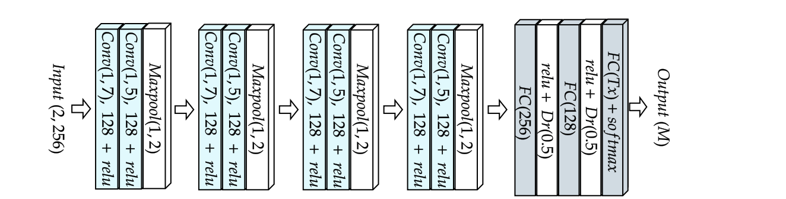
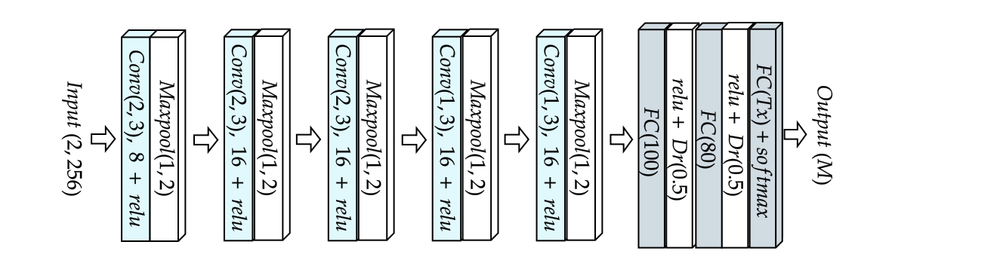

# Investigating Sparse Neural Networks for Radio Frequency Fingerprint Identification
Emma BOTHEREAU∗ , Alice CHILLET∗ , Robin GERZAGUET∗ , Matthieu GAUTIER∗ , Olivier BERDER∗ , 
∗ Univ Rennes, CNRS, IRISA, firstname.name@irisa.fr

In this repository are presented the Neural Networks used for the article in Julia. 

## Description

We used the following neural networks :
- [Sankhe CNN](https://ieeexplore.ieee.org/document/8882379)

- [Hanna CNN](https://arxiv.org/abs/2112.15363))

## Fundings

This work is funded by the French National Research Agency (ANR) under the grant number ANR-22-CE25-0007-01 (RedInBlack project)

